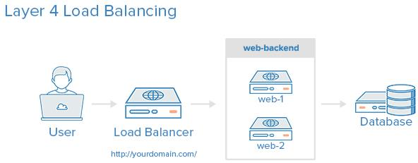
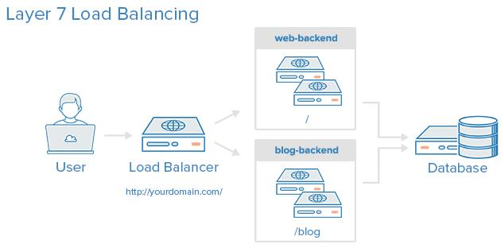
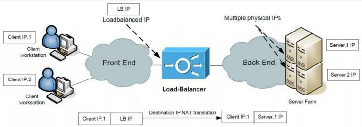
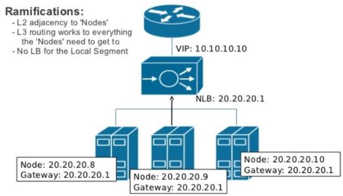
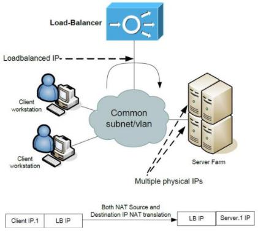
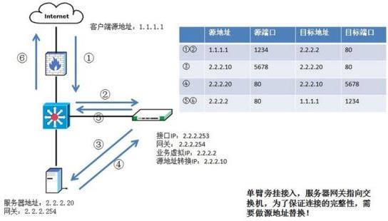
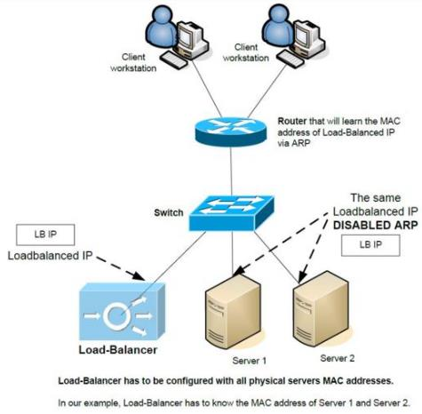
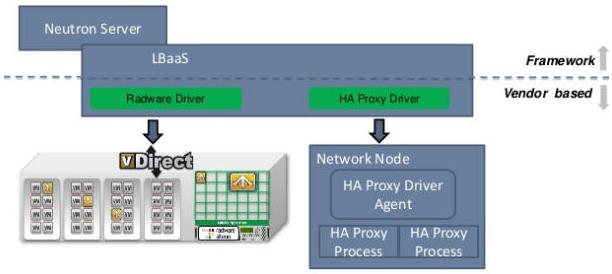
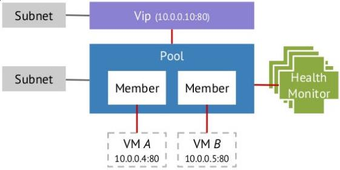
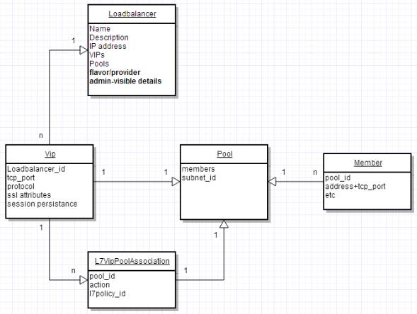

**1.1负载均衡的概念**

负载均衡（Load Balancing）是将来访的网络流量在运行相同应用的多个服务器之间进行分发的一种核心网络服务。它的功能由负载均衡器（Load Balancer）提供。负载均衡器可以是一个硬件设备，也可以由软件实现。它充当反向代理，在多个服务器之间分发网络或者应用流量。它常用来增加应用的访问容量（并发用户数）和可靠性，它也会通过降低服务器的负载来提高应用的总体性能。

（1）负载均衡器的分类

负载均衡器一般可以分为两类：第四层负载均衡器和第七层负载均衡器。

第四层负载均衡器：基于网络和传输协议（IP，TCP，FTP，UDP等）来均衡负载。

第七层的负载均衡器：基于应用层协议比如HTTP，SMTP，SNMP，FTP，Telnet等负载均衡。比如对HTTP来说，第七层的负载均衡器能根据应用的特定数据比如HTTP头，cookiess或者应用消息中的数据来做进一步的请求分发。

（2）负载分发算法

两种类型的负载均衡都能接收请求，然后根据特定的算法将算法分发到特定的服务器。一些行业标准的算法是：

- 轮询（Round robin）：轮流分发到各个（活动）服务器
- 加权轮询（Weighted round robin）：每个服务器有一定的加权（weight），轮询时考虑加权。
- 最少连接（Least connections）：转发到有最少连接数的服务器
- 最少响应时间（Least response time）：转发到响应时间最短的服务器

（3）可靠性和可用性

负载均衡器通过监控应用的健康状态来确保可靠性和可用性，并且只转发请求到能技术做出响应的服务和应用。

（4）Session persistence（会话保持）

会话保持表示在一个会话期间，转发一个用户的请求到同一个后端服务器，这对购物车或者付款类的请求非常重要。常用的方法包括：

- source IP：相同来源的请求转发到同一个服务器
- HTTP Cookie：该模式下，loadbalance为客户端的第一次连接生成cookie，后续携带该cookie的请求会被某个member处理
- APP Cookie：该模式下，依靠后端应用服务器生成的cookie决定被某个member处理

（5）常见的开源软件负载均衡器

- HAProxy
- Linux Virtual Servers（LVS）-包括在许多Linux发行版中的简单快速的4层负载均衡软件
- Nginx-一个快速可靠的web服务器也能当做代理的负载均衡器使用，它常常和HAProxy一起用于缓存和压缩。

LVS：

1. 抗负载均衡能力强，性能高。能够达到F5的硬件的60%；对于内存和cpu资源消耗比较低
2. 工作在网络4层，通过vrrp协议转发（仅做分发），具体流量由linux内核处理，因此没有流量的产生
3. 稳定性、可靠性好，自身有完善的热备方案（LVS+keepalived）
4. 应用范围比较广，可以对所有应用做负载均衡
5. 不支持正则处理，不能做动静分离。
6. 支持负载均衡算法：rr（轮询）、wrr（带权轮询）、lc（最小连接）、wlc（权重最小连接）
7. 配置复杂，对网络依赖比较大，稳定性很高

nginx：

1. 工作在网络的7层之上，可以针对http应用做一些分流的策略，比如针对域名、目录结构
2. nginx对网络的依赖比较小，理论上能ping通就能进行负载功能
3. nginx安装和配置比较简单，测试起来比较方便
4. 也可以承担高的负载压力且稳定，一般能支撑超过1万次的并发
5. 对后端服务器的监看该检查，只支持通过端口来检测，不支持通过url来检测
6. nginx对请求的异步处理可以帮助节点服务器减轻负载
7. nginx仅能支持http、https和stmp协议，使用范围较小
8. 不支持session的直接保持，但能通过ip_hash来解决。对big request header的支持不是很好
9. 支持如在均衡算法：round-robin（轮询）、weight-round-robin（带权轮询）、ip-hash（IP哈希）
10. nginx还能做web服务器

HAProxy：

1. 支持两种代理模式：TCP（四层）和HTTP（七层），支持虚拟主机
2. 能够补充nginx的一些缺点比如session的保持，cookie的引导等工作
3. 支持url检测后端的服务器
4. 更多的负载均衡策略比如：动态加权轮询（dynamic round robin），加权源地址哈希（weight source hash），加权url哈希和加权参数哈希
5. 单纯从效率来讲HAProxy比nginx有更出色的负载均衡速度
6. HAProxy可以对mysql进行负载均衡，对后端db节点进行检测和负载均衡
7. 支持负载均衡算法：round-robin（轮询）、weight-round-robin（带权轮询）、source（源地址保持）、RI（请求url）、rdp-cookie（根据cookie）
8. 不能做web服务器

**1.2三种部署模式**

**1.2.1 tow-arms（双臂）模式**

也成为in-line模式，或者bridge mode模式，或者transparent mode。此时，所有前端访问后端的网络都需要经过LB，它本身也成为了一种router。可见，此时的LB需要两个网卡，分别连接前端和后端。

一个具体IP地址配置示例：

**1.2.2 One-arm（单臂）模式**

该模式中，LB不处于前端和后端的通道上而是在旁边。此时，LB只使用一块网卡，而且该网卡和后端服务器处于同一个二层网络中。该LB的网卡会被分配一个virtual load-balanced IP（VIP）。需要注意的是，此时的LB需要对进来的网络包做Source和Dest NAT然后再交给某个后端服务器，使得后端服务器返回的网络包将会达到LB而不是直接达到前端，再由LB转交给前端。因为使用了SNAT，因此后端看不到网络包的源IP，这在某些需要审计功能的情况下可能无法满足要求。

一个具体的IP地址配置示例：

1.2.3 Direct Server Response 模式

这种模式下，LB只能接收进来的网络包，转给后端服务器后，后端服务器直接将返回包发回给客户端。这种模式的好处是，可以提高网络的吞吐量，坏处是配置较为复杂

**1.3 High Availability Proxy （HAProxy）**

HAProxy是个著名的开源的软件TCP（四层）/ HTTP（七层）负载均衡器和代理（proxy）软件，可以运行在Linux，Solaris和FreeBSD等系统上。它最常用的用途是通过在多个服务器（比如web服务器，应用，数据库等）之间分发负载均衡来改善一个服务器系统的性能和可靠性。目前，它已经被许多大公司采用，包括GitHub，Imgur，Instagram，Twitter等。它类似Nginx的，采用了单进程和事件驱动模型；它使用的内存量低而且稳定，能够处理大量并发请求。

**主要概念**

- Frontend：定义请求如何被转发到backend。
- Backend：一组接收转发的请求的服务器。其定义包括分发算法和一组服务器的地址和端口。

**支持的分发算法：**

- Round robin：平均的将网络流量分发到多个member。
- Source IP ：从某一个特定的IP发来的网络请求，总是发到特定的member。
- Least connections：将收到的网络请求，发给当前负载均衡池中连接数最少的member。如果所有的member连接数一样，则遵循Round robin的方式

Health Check（健康检查）：

HAProxy使用Health Check 来确定一个backend server能不能接收转发的请求。这避免了在服务器不可用时需要手工删除它。默认的Health Check是试着去和一个server建立一个TCP连接，比如，检查该backend server是否在配置的IP和端口上监听。可以指定health check方法，包括tcp，http，ping等。

当一个backend server检查失败时，他就无法接受请求了，就会自动被禁用，请求也不会被转发到该服务器上，知道重新变为可用。如果一个backend内的所有服务器都health check失败，其对应的服务就会变得不可用。

**2.Neutron中的虚拟负载均衡器**

Neutron LBaaS （load-balancer-as-a-service）扩展（extension）提供向在多个Nova虚机中运行的应用提供负载均衡的方法。还提供API来快速方便地部署负载均衡器。早在OpenStack的Grizzly版本就集成到Neutron中，自集成到Neutron以来，LBaaS经历过几次大的变化。目前，在最新发布的Kilo版本中，LBaaS代码冲Neutron中抽离，直接由独立的项目管理，以实现了LBaaS V2。本文是基于Juno版本的LBaaS进行分析。OpenStack Neutron默认以HAProxy为负载均衡的dirver，同时也支持A10 network、netscaler、radware等作为driver。

2.1 LBaaS中的概念

LBaaS可以看做OpenStack Neutron对各种物理负载均衡器的虚拟化。它的概念可以和HAProxy中的概念进行类比：

| HAProxy的概念  | LBaaS的概念    | 说明                                                         |
| -------------- | -------------- | ------------------------------------------------------------ |
|                | Driver         | LBaaS也是采用driver模型来支持多种物理的负载均衡器。LBaaS默认实现了HAProxy driver，同时，它也支持多个其他Vendor driver。 |
| Frontend       | VIP            | LBaaS对外提供服务的地址。VIP有自己的IP地址，而且一般都能通过公网进行访问。VIP负责将网络流量分发到各个member。 |
| Backend        | pool           | 代表负载后端的虚拟机池。在以HAProxy为Driver的情况下，一个pool对应着在一个独立的network namespace中运行的HAProxy进程 |
| Backend server | Member         | Member对应的是pool里面处理网络请求的一个OpenStack Nova虚拟机。 |
| Health check   | Health monitor | 用来检测pool里面member的状态，支持HTTP，TCP，ping等多种检测方法。在Neutron中这是可选的，如果没有Health monitor，pool会一直认为所有的member都是ACTIVE状态，这样左右的member会一直出现在VIP的分发列表中，哪怕member对应的实例不能响应网络请求，在实际应用中会造成负载均衡的响应异常。 |

LBaaS driver 模型：

基本概念：

基本概念之间的联系：

**2.2 LBaaS HAProxy部署实例**

OpenStack 直接采用各种开源可用的负载均衡的任务，默认使用HAProxy。LBaaS所做的任务就是根据用户提出的负载均衡要求生成符合要求的HAProxy配置文件并启动HAProxy，然后由HAproxy进行均衡负载。

不同的LBaaS driver支持不同的部署模式。社区实现LBaaS HAProxy driver只支持one-arm模式。可以部署在LBaaS Agent在network节点上，也可以部署在别的节点上。