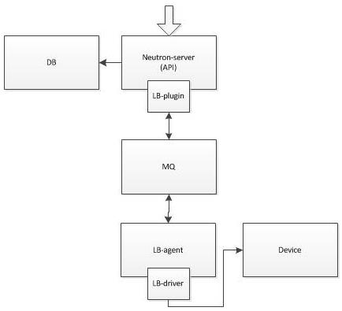

模块示意图：



plugin

neutron_lbaas/service/loadbalancer/plugin.py

class LoadBalancerPluginv2

def __init__(self);

self.db = ldbv2.LoadBalancerPuginDbv2()

driver

neutron_lbaas/driver/haproxy/plugin_driver.py

class HaproxyOnHostPluginDriver(agent_driver_base.AgentDriverBase):

device_driver = namespace_driver.DRIVER_NAME

agent rpc（plugin向agent发送）

neutron_lbaas/drivers/common/agent_driver_base.py

class LoadBalancerAgentApi

def __init__

plugin rpc (agent向plugin发送）

neutron_lbaas/agent/agent_api.py

class LbaasAgentApi

def __init__

agent 侧的回调

neutron_lbaas/agent/agent_manager.py

class LbaasAgentManager

plugin侧的回调

neutron_lbaas/drivers/common/agent_driver_base.py

class AgentDriverBase

def _set_callbacks_on_plugin

neutron_lbaas/drivers/common/agent_callbacks.py

class LoadBalancerCallbacks

agent入口函数

neutron_lbaas/agent/agent.py

def main

db处理

neutron_lbaas/db/loadbalancer/loadbalancer_dbv2.py

class LoadBalancerPluginDbv2

流程示例，创建一个pool

plugin部分

首先进入一个同步流程，创建pool数据库信息

```python
def create_pool(self, context, pool):
    pool = pool.get('pool')#获取pool
    listener_id = pool.get('listener_id')#获取listener_id
    listeners = pool.get('listeners', [])#获取listener数组（绑定pool）
    if listener_id:
        assert isinstance(listeners.append, object)#声明对象
        listeners.append(listener_id)
    lb_id = pool.get('loadbalancer_id')#获取loadbalancer_id
    db_listeners = []#创建listener空数组
    for l in listeners:
        db_l = self.db.get_listener(context, l)
        db_listeners.append(db_l)
        # Take the pool's loadbalancer_id from the first listener found
        # if it wasn't specified in the API call.
        if not lb_id:
            lb_id = db_l.loadbalancer.id
        # All specified listeners must be on the same loadbalancer
        if db_l.loadbalancer.id != lb_id:#判定loadbalancer——id是否正确
            raise sharedpools.ListenerAndPoolMustBeOnSameLoadbalancer()
        if db_l.default_pool_id:#判定是否是默认pool_id
            raise sharedpools.ListenerDefaultPoolAlreadySet(
                listener_id=db_l.id, pool_id=db_l.default_pool_id)
        if ((pool['protocol'], db_l.protocol)#判定协议是否兼容
            not in lb_const.LISTENER_POOL_COMPATIBLE_PROTOCOLS):
            raise loadbalancerv2.ListenerPoolProtocolMismatch(
                listener_proto=db_l.protocol,
                pool_proto=pool['protocol'])
    if not lb_id:
        raise sharedpools.PoolMustHaveLoadbalancer()
    pool['loadbalancer_id'] = lb_id
    self._validate_session_persistence_info(
        pool.get('session_persistence'))
    # SQLAlchemy gets strange ideas about populating the pool if we don't
    # blank out the listeners at this point.
    del pool['listener_id']
    pool['listeners'] = []
    self.db.test_and_set_status(context, models.LoadBalancer,
                                lb_id, n_constants.PENDING_UPDATE)
    db_pool = self.db.create_pool(context, pool)#创建pool
    for db_l in db_listeners:
        try:
            self.db.update_listener(context, db_l.id,
                                    {'default_pool_id': db_pool.id})#将pool绑定listener
        except Exception as exc:
            self.db.update_loadbalancer_provisioning_status(
                context, db_pool.loadbalancer_id)#更新loadbalancer服务状态
            raise exc
    
    db_pool.listeners = self.db.get_listeners(
        context, filters={'default_pool_id': [db_pool.id]})
    #根据创建lb时的provider来选择driver
    driver = self._get_driver_for_loadbalancer(
        context, db_pool.loadbalancer_id)#将调用的driver的pool.create方法，进入driver的父类
    self._call_driver_operation(context, driver.pool.create, db_pool)
    return db_pool.to_api_dict()#同步返回pool的信息到数据库
```

plugin的api及rpc处理

neutron_lbaas/drivers/common/agent_driver_base.py

```python
class AgentDriverBase(driver_base.LoadBalancerBaseDriver):

    # name of device driver that should be used by the agent;
    # vendor specific plugin drivers must override it;
    device_driver = None

    def __init__(self, plugin):
        super(AgentDriverBase, self).__init__(plugin)
        #pool的管理类
        if not self.device_driver:
            raise DriverNotSpecified()

        self.load_balancer = LoadBalancerManager(self)
        self.listener = ListenerManager(self)
        self.pool = PoolManager(self)
        #agent的rpc处理类
        self.member = MemberManager(self)
        self.health_monitor = HealthMonitorManager(self)

        self.agent_rpc = LoadBalancerAgentApi(lb_const.LOADBALANCER_AGENTV2)
        #rpc的回调
        self.agent_endpoints = [
            agent_callbacks.LoadBalancerCallbacks(self.plugin),
            agents_db.AgentExtRpcCallback(self.plugin.db)
        ]

        self.conn = None

        # Setting this on the db because the plugin no longer inherts from
        # database classes, the db does.
        self.plugin.db.agent_notifiers.update(
            {lb_const.AGENT_TYPE_LOADBALANCERV2: self.agent_rpc})
        #agent的调度driver
        lb_sched_driver = provconf.get_provider_driver_class(
            cfg.CONF.loadbalancer_scheduler_driver, LB_SCHEDULERS)
        self.loadbalancer_scheduler = importutils.import_object(
            lb_sched_driver)

class PoolManager(driver_base.BasePoolManager):
    def create(self, context, pool):
        super(PoolManager, self).create(context, pool)
        #从数据库中选择了一个agent
        agent = self.driver.get_loadbalancer_agent(
            context, pool.loadbalancer.id)
        #向这个agent发送create_pool这个任务
        #进入LoadBalancerAgentApi的create_pool
        self.driver.agent_rpc.create_pool(context, pool, agent['host'])
        
class LoadBalancerAgentApi(object):
    """Plugin side of plugin to agent RPC API."""

    # history
    #   1.0 Initial version
    #

    def __init__(self, topic):
        target = messaging.Target(topic=topic, version='1.0')
        self.client = n_rpc.get_client(target,
                                       serializer=DataModelSerializer())

    def create_pool(self, context, pool, host):
        cctxt = self.client.prepare(server=host)
        #向agent发送create_pool的消息
        cctxt.cast(context, 'create_pool', pool=pool)

```

agent的入口

neutron_lbaas/agent/agent/agent.py

```python
def main():
    cfg.CONF.register_opts(OPTS)
    cfg.CONF.register_opts(manager.OPTS)
    # import interface options just in case the driver uses namespaces
    config.register_interface_opts(cfg.CONF)
    config.register_external_process_opts(cfg.CONF)
    config.register_interface_driver_opts_helper(cfg.CONF)
    config.register_agent_state_opts_helper(cfg.CONF)
    config.register_root_helper(cfg.CONF)

    common_config.init(sys.argv[1:])
    config.setup_logging()
    config.setup_privsep()

    LOG.warning('neutron-lbaas is now deprecated. See: '
                'https://wiki.openstack.org/wiki/Neutron/LBaaS/Deprecation')
    #mgr指向LBaasAgentManager
    #创建pool即为create_pool函数
    mgr = manager.LbaasAgentManager(cfg.CONF)
    svc = LbaasAgentService(
        host=cfg.CONF.host,
        topic=constants.LOADBALANCER_AGENTV2,
        manager=mgr
    )
    service.launch(cfg.CONF, svc).wait()

```

agent处理plugin下发的消息

neutron_lbaas/agent/agent_manager.py

```python
class LbaasAgentManager(periodic_task.PeriodicTasks):

    def create_pool(self, context, pool):
        pool = data_models.Pool.from_dict(pool)
        #根据pool对象的listener.loadbalancer.id获取driver
        #根据配置文件找到device_driver参数的值
        driver = self._get_driver(pool.loadbalancer.id)
        try:
            #driver创建pool
            #如选用默认的haproxy，函数路径如下:PoolManager中的create函数
            driver.pool.create(pool)
        except Exception:
            self._handle_failed_driver_call('create', pool, driver.get_name())
        else:
            #回报状态
            self._update_statuses(pool)

```

agent将任务下发给driver

neutron_lbaas/driver/haproxy/namespace_driver.py

```python
def get_ns_name(namespace_id):
    #返回namespace的名字
    return NS_PREFIX + namespace_id

class HaproxyNSDriver(agent_device_driver.AgentDeviceDriver):

    def __init__(self, conf, plugin_rpc, process_monitor):
        super(HaproxyNSDriver, self).__init__(conf, plugin_rpc,
                                              process_monitor)
        #指向了PoolManager
        #self（也就是PoolManager中的self.driver）即为HaproxyNSDriver
        self.state_path = conf.haproxy.loadbalancer_state_path
        self.state_path = os.path.join(
            self.conf.haproxy.loadbalancer_state_path, STATE_PATH_V2_APPEND)
        try:
            vif_driver_class = runtime.load_class_by_alias_or_classname(
                'neutron.interface_drivers',
                conf.interface_driver)
        except ImportError:
            with excutils.save_and_reraise_exception():
                msg = (_('Error importing interface driver: %s')
                       % conf.interface_driver)
                LOG.error(msg)

        self.vif_driver = vif_driver_class(conf)
        self.deployed_loadbalancers = {}
        self._loadbalancer = LoadBalancerManager(self)
        self._listener = ListenerManager(self)
        self._pool = PoolManager(self)
        #指向了LoadBalancerManager
        #self（也就是LoadBalancerManager中的self.driver）即为HaproxyNSDriver
        self._member = MemberManager(self)
        self._healthmonitor = HealthMonitorManager(self)

    @property
    def loadbalancer(self):
        return self._loadbalancer

    @property
    def pool(self):
        return self._pool

```

neutron_lbaas/drivers/haproxy/namespace_driver.py

```python
class PoolManager(agent_device_driver.BasePoolManager):

    def create(self, pool):
        #调用了LoadBalancerManager的refresh函数
        self.driver.loadbalancer.refresh(pool.loadbalancer)

class LoadBalancerManager(agent_device_driver.BaseLoadBalancerManager):

    def refresh(self, loadbalancer):
        #调用了LbaasAgentApi的get_loadbalancer函数
        loadbalancer_dict = self.driver.plugin_rpc.get_loadbalancer(
            loadbalancer.id)
        #根据返回的lb的dict生成一个lb的object
        loadbalancer = data_models.LoadBalancer.from_dict(loadbalancer_dict)
        #部署lb
        #调用了HaproxyNSDriver的deploy_instance
        if (not self.driver.deploy_instance(loadbalancer) and
                self.driver.exists(loadbalancer.id)):
            self.driver.undeploy_instance(loadbalancer.id)

```

driver通过rpc访问plugin侧的db

neutron_lbaas/agent/agent_api.py

```python
class PoolManager(agent_device_driver.BasePoolManager):

    def create(self, pool):
        #调用了LoadBalancerManager的refresh函数
        self.driver.loadbalancer.refresh(pool.loadbalancer)

class LoadBalancerManager(agent_device_driver.BaseLoadBalancerManager):

    def refresh(self, loadbalancer):
        #调用了LbaasAgentApi的get_loadbalancer函数
        loadbalancer_dict = self.driver.plugin_rpc.get_loadbalancer(
            loadbalancer.id)
        #根据返回的lb的dict生成一个lb的object
        loadbalancer = data_models.LoadBalancer.from_dict(loadbalancer_dict)
        #部署lb
        #调用了HaproxyNSDriver的deploy_instance
        if (not self.driver.deploy_instance(loadbalancer) and
                self.driver.exists(loadbalancer.id)):
            self.driver.undeploy_instance(loadbalancer.id)

```

neutron_lbaas/driver/common/agent_callbacks.py

```python
class LoadBalancerCallbacks(object):
    def get_loadbalancer(self, context, loadbalancer_id=None):
        #这里指向LoadBalancerPluginDbv2的get_loadbalancer函数
        lb_model = self.plugin.db.get_loadbalancer(context, loadbalancer_id)
        if lb_model.vip_port and lb_model.vip_port.fixed_ips:
            for fixed_ip in lb_model.vip_port.fixed_ips:
                subnet_dict = self.plugin.db._core_plugin.get_subnet(
                    context, fixed_ip.subnet_id
                )
                setattr(fixed_ip, 'subnet', data_models.Subnet.from_dict(
                    subnet_dict))
        if lb_model.provider:
            device_driver = self.plugin.drivers[
                lb_model.provider.provider_name].device_driver
            setattr(lb_model.provider, 'device_driver', device_driver)
        if lb_model.vip_port:
            network_dict = self.plugin.db._core_plugin.get_network(
                context, lb_model.vip_port.network_id)
            setattr(lb_model.vip_port, 'network',
                    data_models.Network.from_dict(network_dict))
        #将这个LoadBalancer的object转换dict
        lb_dict = lb_model.to_dict(stats=False)
        #返回这个字典
        #回到LbaasAgentApi的get_loadbalancer函数
        return lb_dict

```

neutron_lbaas/db/loadbalancer/loadbalancer_dbv2.py

```python

class LoadBalancerPluginDbv2(base_db.CommonDbMixin,
                             agent_scheduler.LbaasAgentSchedulerDbMixin):

    def get_loadbalancer(self, context, id):
        lb_db = self._get_resource(context, models.LoadBalancer, id)
        #返回一个LoadBalancer的object
        #回到LoadBalancerCallbacks的get_loadbalancer函数
        return data_models.LoadBalancer.from_sqlalchemy_model(lb_db)

```

driver开始执行实际操作

neutron_lbaas/drivers/haproxy/namespace_driver.py

```python
class HaproxyNSDriver(agent_device_driver.AgentDeviceDriver):

    @runtime.synchronized('haproxy-driver')
    def deploy_instance(self, loadbalancer):
        """Deploys loadbalancer if necessary

        :returns: True if loadbalancer was deployed, False otherwise
        """
        #部署一个lb，如果已经有，则返回True，否则返回False
        #deployable函数用于检查是否可以部署
        #如listener是否已经准备就绪或可用，如可以返回True，不可以则返回False
        if not self.deployable(loadbalancer):
            LOG.info("Loadbalancer %s is not deployable." %
                     loadbalancer.id)
            return False

        if self.exists(loadbalancer.id):
            self.update(loadbalancer)
        else:
            #创建，进入create函数
            self.create(loadbalancer)
        return True
        
        
    def deployable(self, loadbalancer):
        #如果lb已经active了，返回True，否则返回False
        if not loadbalancer:
            return False
        acceptable_listeners = [
            listener for listener in loadbalancer.listeners
            if (listener.provisioning_status != constants.PENDING_DELETE and
                listener.admin_state_up)]
        return (bool(acceptable_listeners) and loadbalancer.admin_state_up and
                loadbalancer.provisioning_status != constants.PENDING_DELETE)
        #回到HaproxyNSDriver的deploy_instance函数
                
    def create(self, loadbalancer):
        namespace = get_ns_name(loadbalancer.id)
        #挂载网卡，将进入_plug函数
        self._plug(namespace, loadbalancer.vip_port, loadbalancer.vip_address)
        #孵化lb，进入_spawn函数
        self._spawn(loadbalancer)
        
    def _plug(self, namespace, port, vip_address, reuse_existing=True):
        #调用LbaasAgentApi的plug_vip_port函数，rpc的publisher
        self.plugin_rpc.plug_vip_port(port.id)
        #tapxxxxxxxx-xx
        interface_name = self.vif_driver.get_device_name(port)
        
        #如果这个namespace中有这个interface，返回True，否则返回False
        if ip_lib.device_exists(interface_name,
                                namespace=namespace):
            if not reuse_existing:
                raise exceptions.PreexistingDeviceFailure(
                    dev_name=interface_name
                )
        else:
            self.vif_driver.plug(
                port.network_id,
                port.id,
                interface_name,
                port.mac_address,
                namespace=namespace,
                mtu=port.network.mtu
            )
    
        cidrs = [
            '%s/%s' % (ip.ip_address,
                       netaddr.IPNetwork(ip.subnet.cidr).prefixlen)
            for ip in port.fixed_ips
        ]
        #根据port的信息建立l3
        self.vif_driver.init_l3(interface_name, cidrs, namespace=namespace)
    
        # Haproxy socket binding to IPv6 VIP address will fail if this address
        # is not yet ready(i.e tentative address).
        if netaddr.IPAddress(vip_address).version == 6:
            device = ip_lib.IPDevice(interface_name, namespace=namespace)
            device.addr.wait_until_address_ready(vip_address)
    
        # Add subnet host routes
        host_routes = port.fixed_ips[0].subnet.host_routes
        for host_route in host_routes:
            if host_route.destination != "0.0.0.0/0":
                cmd = ['route', 'add', '-net', host_route.destination,
                       'gw', host_route.nexthop]
                ip_wrapper = ip_lib.IPWrapper(namespace=namespace)
                ip_wrapper.netns.execute(cmd, check_exit_code=False)
    
        gw_ip = port.fixed_ips[0].subnet.gateway_ip
    
        if not gw_ip:
            for host_route in host_routes:
                if host_route.destination == "0.0.0.0/0":
                    gw_ip = host_route.nexthop
                    break
        else:
            cmd = ['route', 'add', 'default', 'gw', gw_ip]
            #添加默认路由
            ip_wrapper = ip_lib.IPWrapper(namespace=namespace)
            #ip netns exec ns env *** route add default gw gw_ip
            ip_wrapper.netns.execute(cmd, check_exit_code=False)
                # When delete and re-add the same vip, we need to
            # send gratuitous ARP to flush the ARP cache in the Router.
            gratuitous_arp = self.conf.haproxy.send_gratuitous_arp
            if gratuitous_arp > 0:
                for ip in port.fixed_ips:
                    cmd_arping = ['arping', '-U',
                                  '-I', interface_name,
                                  '-c', gratuitous_arp,
                                  ip.ip_address]
                    ip_wrapper.netns.execute(cmd_arping, check_exit_code=False)
            #回到create函数
    def _spawn(self, loadbalancer, extra_cmd_args=()):
        conf_path = self._get_state_file_path(loadbalancer.id,
                                              'haproxy.conf')
        sock_path = self._get_state_file_path(loadbalancer.id,
                                              'haproxy_stats.sock')
        user_group = self.conf.haproxy.user_group
        haproxy_base_dir = self._get_state_file_path(loadbalancer.id, '')
        jinja_cfg.save_config(conf_path,
                              loadbalancer,
                              sock_path,
                              user_group,
                              haproxy_base_dir)
    
        def callback(pid_path):
            cmd = ['haproxy', '-f', conf_path, '-p', pid_path]
            cmd.extend(extra_cmd_args)
            return cmd
    
        pid_data = self._get_state_file_path(loadbalancer.id, 'haproxy.pid')
        pid_path = os.path.split(pid_data)[0]
        namespace = get_ns_name(loadbalancer.id)
        pm = external_process.ProcessManager(
            uuid=loadbalancer.id,
            default_cmd_callback=callback,
            namespace=namespace,
            service=HAPROXY_SERVICE_NAME,
            conf=self.conf,
            pids_path=pid_path,
            pid_file=pid_data,
            custom_reload_callback=callback if extra_cmd_args else None)
        if pm.active:
            pm.reload_cfg()
        else:
            pm.enable()
        self.process_monitor.register(uuid=loadbalancer.id,
                                      service_name=HAPROXY_SERVICE_NAME,
                                      monitored_process=pm)
        # remember deployed loadbalancer id
        self.deployed_loadbalancers[loadbalancer.id] = loadbalancer

```

