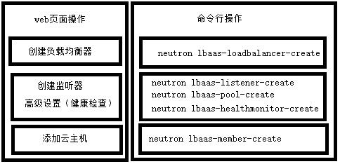
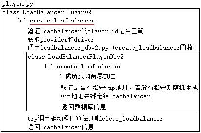
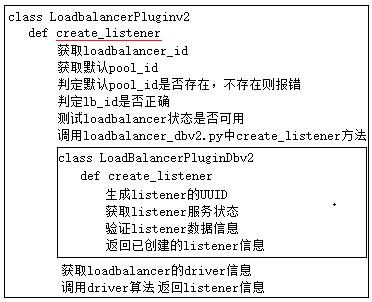
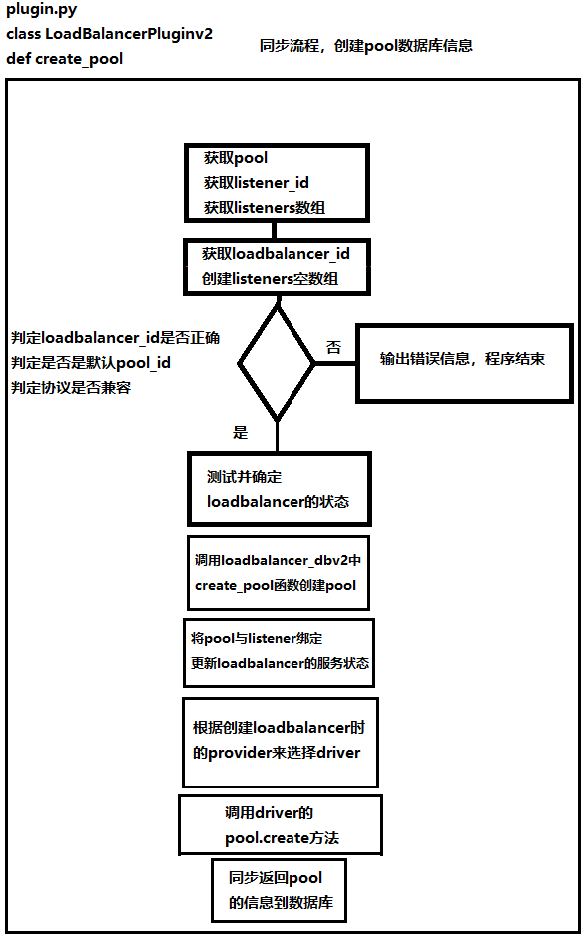
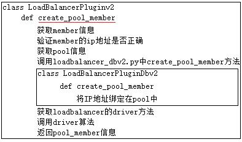
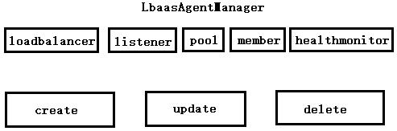
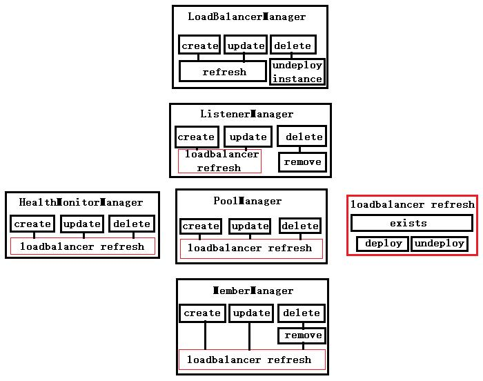
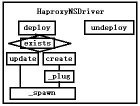
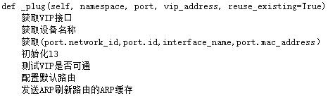
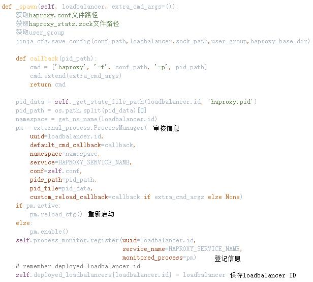

web操作页面对应命令行操作：

创建负载均衡器：neutron lbaas-loadbalancer-create

创建监听器：neutron lbaas-listener-create、neutron lbaas-pool-create

开启健康检查：neutron lbaas-healthmonitor-create

添加云主机：neutron lbaas-member-create

**源码分析**

**同步数据库部分**

创建loadbalancer：

创建listener：

创建pool：

添加云主机：

创建函数调用过程：

LbaasAgentManager中对于loadbalancer、listener、pool、member、healthmonitor的create、update、delete都有对应的入口函数，对应调用LoadBalancerManager、ListenerManager、PoolManager、MemberManager、HealthMonitorManager。

进入相应的Manager后，有对应的create、update、delete方法。其中，对于Listener、Pool、Member、HealthMonitor的操作都需要经过LoadBalancerManager，对响应的负载均衡器进行refresh。

refresh函数中，有对应的调用HaproxyNSDriver，部署和解部署方法。

在部署（deploy）方法中有create和update。其中，create需要的_plug方法主要是获取信息和初始化网络。

而_spawn方法则是配置haproxy.conf文件并保存，_spawn方法中包含了callback函数，用于审核对应信息，进行登记和保存。

