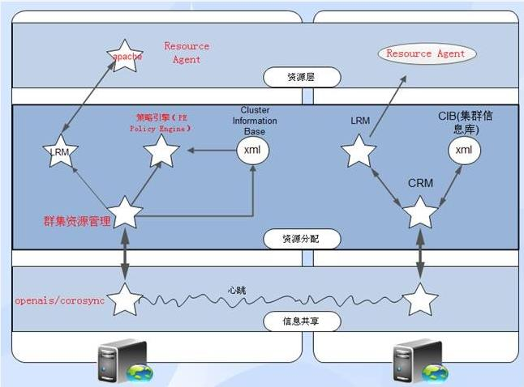
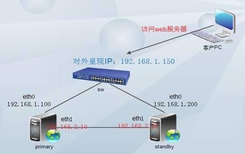

高可用性集群一般是指当集群中有某个节点失效的情况下，其上的任务会自动转移到其他正常的节点上，还指可以将集群中的某节点进行离线维护再上线，该过程并不影响整个集群的运行。

**高可用性集群的架构**

1）共享信息层

在基础架构上实现心跳信息探测，双方节点可以随时探测到对方的心跳，以实现对对方主机工作状态的探测。三类控制信息：心跳（Heartbeats），集群事务信息（Cluster Transition Messages），重传信息（Retransmission Request）。配置文件：/ect/ha.d/ha.cf。各节点间域共享密钥，实现节点间互相通信的认证。加密方式：MD5、HMAC-SHA1。常用实现软件：HeartBeat、Keepalived、ultramonkey、openais/corosync。红毛官方提供的集群套间RHCS底层使用的是通信机制就是openais/corosync。

2）资源分配子层

在资源分配上定义资源种类，界定资源归属，每个服务需要哪些资源及这些资源之间的前后次序。

集群资源管理器（CRM，常用软件pacemaker），管理双方向外提供服务所需要用到的资源，包括IP地址、Web服务、共享存储等等。而这些资源需要依靠集群信息库CIB（XML文件）来定义，同时还必须保证一旦某个节点上的XML文件更新，即刻通知其他节点上的XML也要及时更新。

策略引擎（PE Policy Engine）：定义法定人数以及根据法定人数所作出的动作等等。

本地资源管理器（LRM Local Resource Manager）：监控本地某个资源的工作状况。

3）资源层

本地资源代理（Resource Agent），脚本文件，一旦集群资源管理器发现某个资源工作异常，立即通知本地资源代理重启服务。常用方法：

1、Heartbeat；

2、使用脚本LSB scripts（Linux Standards Base）；

3、OCF Open Cluster Format 开放集；

**常用的架构模型**

1）主从架构：正常情况下只有主服务器工作，当主服务器宕机，从服务器立即启用。

2）互为主从架构：两台服务器提供不同的服务，互为主从架构，两台服务器同时工作。

3）多主机架构

N台主机组成一个集群，分别提供不同的服务，一台服务器空闲做备用节点。或者全部处于工作状态，一台服务器出故障，立即将服务转移到其他主机上。各节点之间需要以多播的形式将自己的健康情况发送给其他主机。

**高可用集群的实现**

1）主从架构

